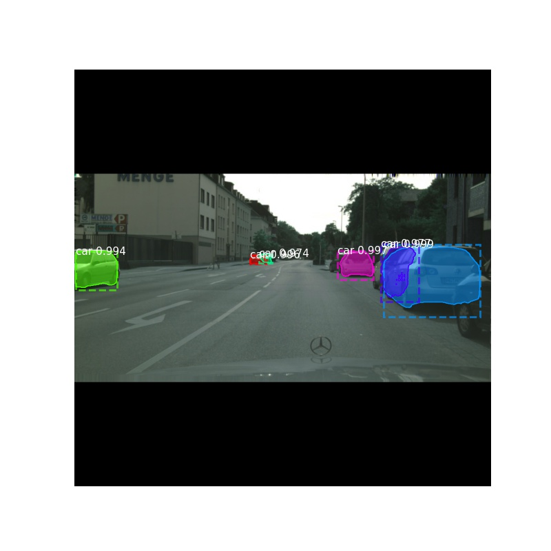
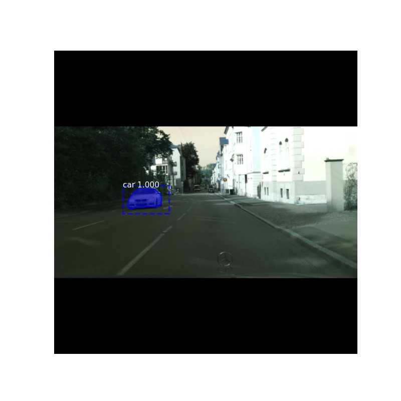

# repnlscnn
This is an implementation of rewritten [Mask RCNN](https://github.com/matterport/Mask_RCNN) with reparameterized layers based on RepVGG design and different attention blocks, including non-local block, SE block, CBAM block, GC block, SC block and NL-SC block.

# Detection show
Some detection results on Cityscapes dataset.

# Train and Test
Step-by-step instruction is coming soon.
Training with precise roi pooling need the compile of nvcc, which may cause cuda version error, so in training code, precise roi pooling is replaced by double summation to avoid it. Or just ignore it. If the complie of prroipool is successful, just cancel the "#" before the importi line.
# Unfinished work
The deployment of repvgg layers should be rewritten in keras with an easier way instead of counting the number of layers to merge the parameter of every rep-layer.
